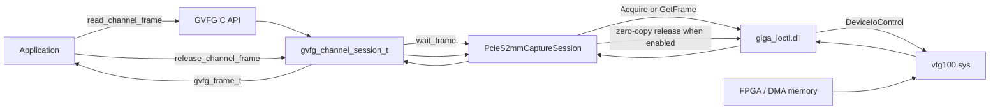
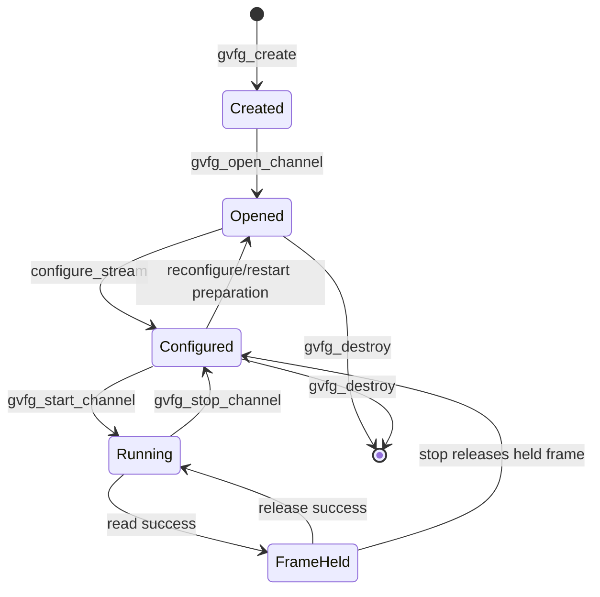
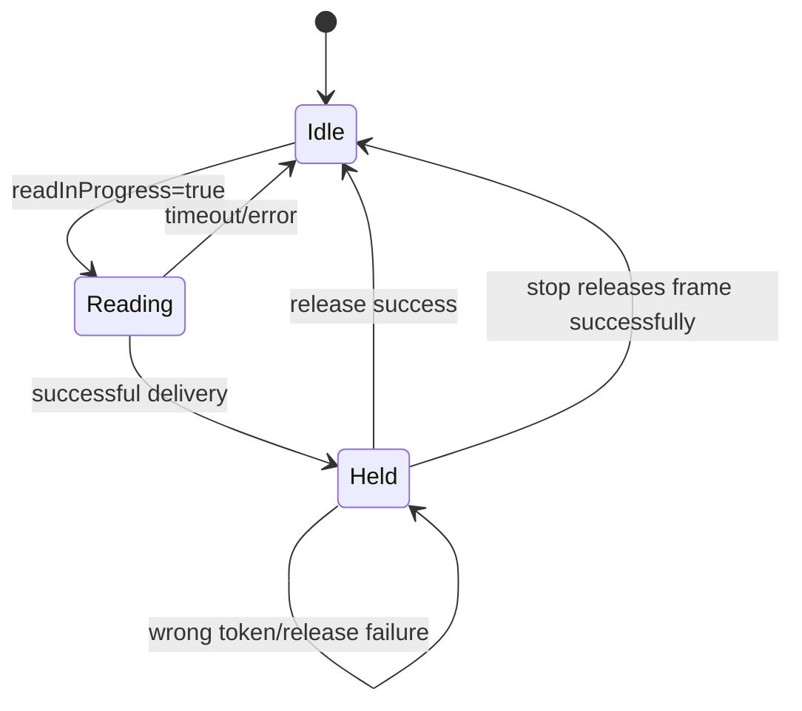

# GVFG 影像資料流與狀態變數

本文從公開 API 一路追到 driver，說明 copy／zero-copy 的資料位置、read/release ownership，以及 start、stop、signal event、format change 使用的狀態變數。

## 1. 全體資料流



`giga_ioctl.dll` 是薄的 driver ABI wrapper；它不持有 capture state 或 frame lifetime。

## 2. 三層狀態

### `gvfg_handle_t`：整張裝置

| 變數 | 意義 |
|---|---|
| `deviceConnection` | CH0、CH1 共用的 Windows device connection |
| `channels[2]` | CH0、CH1 facade session；未 open 時為 null |
| `channelErrors[2]` | 每條 channel 最近一次詳細錯誤 |
| `eventMasks[2]` | open 前設定的 channel event mask |
| `currentIndex` | 此 handle 已綁定的 device index；`-1` 表示尚未綁定 |
| `zeroCopyRequested[2]` | 各 channel open 前獨立選擇的 delivery mode |

### `gvfg_channel_session_t`：公開 API facade

| 變數 | 保護方式 | 意義 |
|---|---|---|
| `backend` | lifecycle 規則 | 此 channel 的 backend；null 表示未 open |
| `running` | `atomic<bool>` | facade 是否允許 read |
| `readInProgress` | `frameMutex` | 是否已有一個 caller 正在 blocking read |
| `frameHeld` | `frameMutex` | 是否已有成功 frame 尚未 release |
| `heldBackendFrame` | `frameMutex` | release 時要交還 backend 的完整 token |
| `eventQueue` | `eventMutex` | facade 待 application poll 的 event queue |
| signal 欄位 | `stateMutex` | width/height/format/connected cache |
| delivered/FPS 欄位 | atomic | UI/debug runtime 統計 |

### `PcieS2mmCaptureSession`：driver backend

| 變數 | 保護方式 | 意義 |
|---|---|---|
| `device_connection_` | shared ownership | 共用 Windows `HANDLE` |
| `channel_` | start 前設定 | 此 backend 對應 CH0 或 CH1 |
| `configured_` | `mutex_`/lifecycle | stream descriptor 與 buffer 是否已配置 |
| `zero_copy_enabled_` | lifecycle | 使用 Acquire/Release 或 copy GetFrame |
| `running_` | atomic | backend stream 是否運行 |
| `monitoring_` | atomic | event thread 是否運行 |
| `capture_active_` | atomic | VIDEO_START 是否已送出 |
| `reader_ready_` | atomic | application 是否已進入 read path |
| `signal_probe_active_` | atomic | 有 signal，可在第一次 read 啟動 DMA |
| `stream_ready_pending_` | atomic | 首張成功 frame 後是否要送 STREAM_READY |
| `read_in_progress_` | `mutex_` | backend 是否已有 wait_frame 執行中 |
| `frame_held_` | `mutex_` | backend 是否已交付一張尚未 release 的 frame |
| `held_frame_` | `mutex_` | backend lifetime token |
| `copy_buffer_` | `mutex_`/lifecycle | copy mode 的實際 frame storage |
| `dma_event_` | backend ownership | driver 通知 frame ready |
| format/plug events | backend ownership | signal與格式事件 |

## 3. Lifecycle 狀態機



這是方便理解的概念狀態圖；程式不是用單一 enum 保存全部狀態，而是由 `backend != nullptr`、`configured_`、`running`、`frameHeld` 等變數共同表示。

## 4. 建立與開啟

### `gvfg_create()`

只建立 `gvfg_handle_t`：

```text
deviceConnection = null
channels[0] = null
channels[1] = null
currentIndex = -1
```

沒有 driver handle、channel backend 或 frame buffer。

### `gvfg_open_channel()`

第一次 open：

```text
建立 gvfg_channel_session_t
    -> 建立 PcieS2mmCaptureSession
    -> CreateFileW() 得到 Windows HANDLE
    -> 建立 PcieS2mmDeviceConnection
    -> gvfg_handle_t 保存 shared_ptr
    -> backend set_channel(CH0 或 CH1)
    -> 建立並註冊該 channel events
```

第二條 channel：

```text
建立另一個 channel/backend
    -> 直接共用既有 deviceConnection
    -> 不再次 CreateFileW()
    -> 建立自己的 events 與狀態
```

## 5. Start 與 buffer 配置

`gvfg_start_channel()` 先執行 `configureStream()`：

1. 讀取 signal status。
2. 決定 width、height、pixel format。
3. 呼叫 backend `configure_stream()`。
4. 計算 `frame_size_bytes()`。
5. 清除上一份 held/read/timing state。

Copy mode：

```cpp
copy_buffer_.assign(bytes, 0);
```

Zero-copy mode：

```cpp
copy_buffer_.clear();
```

因為影像記憶體由 driver/DMA 提供，SDK 不需要配置完整 frame storage。

當沒有輸入訊號時，configure 使用最小 placeholder 讓 event monitoring 可以運作；訊號恢復後會依真實格式重建 buffer。

## 6. 第一次 read 如何啟動 DMA

`start_stream()` 會先準備 monitoring 與 signal 狀態，但 reader capture 是 deferred 的。第一次 `wait_frame()` 進入時：

```text
確認 running、configured、沒有 held/read
    -> reader_ready_ = true
    -> 若 capture_active_ = false 且 signal 可用
        -> ResetEvent(dma_event_)
        -> VIDEO_START(channel)
        -> capture_active_ = true
        -> stream_ready_pending_ = true
    -> read_in_progress_ = true
    -> WaitForSingleObject(dma_event_, remaining deadline)
```

`ResetEvent()` 必須發生在 `VIDEO_START` 前，避免讀到上一次留下的 signaled state。

## 7. Copy mode 資料流

```text
DMA event
    -> giga_ioctl_get_frame(
           channel,
           frameIndex = 0xFFFFFFFF,
           copy_buffer_.data(),
           frameBytes)
    -> driver 將資料複製到 SDK copy_buffer_
    -> held_frame_.data = copy_buffer_.data()
    -> backend frame_held_ = true
    -> facade heldBackendFrame = frame
    -> facade frameHeld = true
    -> gvfg_frame_t.data 交給 application
```

資料 ownership：

```text
copy_buffer_ 由 backend 擁有
application 只借用 data pointer
release 前 pointer 有效
```

即使 copy 已完成，也仍要求 release，因為 release 是統一的 frame lifetime boundary，並允許 SDK 阻止下一次 read 覆蓋同一 buffer。

## 8. Zero-copy 資料流

```text
DMA event
    -> giga_ioctl_acquire_video_frame_zerocopy(channel)
    -> driver 回傳 DMA memory pointer
    -> held_frame_.data = driver pointer
    -> backend frame_held_ = true
    -> facade frameHeld = true
    -> pointer 交給 application
```

Application 使用完成後：

```text
gvfg_release_channel_frame
    -> facade 驗證完整 token
    -> backend 驗證完整 token
    -> giga_ioctl_release_video_frame(channel)
    -> release 成功後才清除 held state
```

Zero-copy 的 `data` 不是 SDK memory。release 前不能保存 pointer 給非同步工作繼續使用。

## 9. Read/release 小狀態機



Facade 與 backend 各自保存一層狀態：

```text
facade:  readInProgress / frameHeld / heldBackendFrame
backend: read_in_progress_ / frame_held_ / held_frame_
```

兩層的目的不同：

- facade 保護公開 API contract 與 `gvfg_frame_t` token。
- backend 保護 driver buffer／DMA ownership 與底層 concurrent read。

## 10. Release token 為什麼要完整比對

Release 不是只看 `data` pointer。程式會比對：

- data pointer
- data size
- frame ID
- width/height
- stride
- pixel format
- bit depth

這可避免 caller 把 CH0 token 用於 CH1、使用舊 frame、修改 descriptor，或重複 release。

重要規則：token 驗證失敗或一般 zero-copy release IOCTL 失敗時，不可先清除
held state。唯一例外是 backend 已經收到 plug-out、確認 signal disconnected，且
driver 對該 outstanding frame 回傳 `ERROR_BAD_COMMAND (22)`；此時 driver 已因拔線
撤銷 ownership，SDK 會清除相符的本地 held token，避免 unplug handler 與後續
replug 永久卡住。Application 仍必須對每次成功 read 呼叫一次 release，不應自行
特判 error 22。

## 11. Signal 與 format-change 狀態

Backend 維護：

```text
signal_presence_known_
signal_present_
signal_probe_active_
signal_metadata_valid_
cached_signal_
stream_desc_
```

用途：

- `signal_presence_known_`：目前是否已有可信的 connected/disconnected 判斷。
- `signal_present_`：目前是否判定有輸入訊號。
- `signal_probe_active_`：read path 是否可嘗試啟動 DMA。
- `signal_metadata_valid_`：cached width/height/format 是否有效。
- `cached_signal_`：最近一次 signal descriptor。
- `stream_desc_`：目前 backend 配置與交付 frame 使用的格式。

Event thread 監聽：

- format change
- plug in
- plug out

Event 會更新 backend state，並透過 callback 放進 facade `eventQueue`。Application 使用 `gvfg_poll_channel_event()` 消費。

事件不是 frame data；它們只改變控制狀態與觸發重新確認／重建流程。

## 12. Stop 順序

Facade：

```text
running = false
    -> releaseHeldFrameForStop()
    -> backend->stop_stream()
    -> 清空 eventQueue
    -> eventCv.notify_all()
```

Backend：

```text
running_ = false
capture_active_ = false
reader_ready_ = false
signal_probe_active_ = false
    -> VIDEO_STOP
    -> SetEvent(dma_event_) 喚醒 blocking wait
    -> 等 read_in_progress_ 結束
    -> release pending zero-copy frame
    -> stop/join event monitoring thread
```

停止順序不能只把 bool 設成 false；必須處理仍在 wait 的 thread 與仍由 caller/driver 持有的 frame。

## 13. 多執行緒規則

- 每條 channel 最多一個 frame read thread。
- CH0 與 CH1 可以各有自己的 read thread。
- 同一 channel 成功 read 後，release 前不可再次 read。
- Application 的 stop flag 應先設定，再 join application capture thread，最後呼叫 SDK stop。
- 不可讓 preview/render thread 在 release 後繼續使用原始 frame pointer；需要非同步使用時先複製到 application-owned memory。

## 14. 目前待驗證項目

- CH0、CH1 同時 start/read/release 的硬體測試。
- copy 與 zero-copy 各自的雙通道壓力測試。
- stop while read is blocked。
- stop while application holds a frame。
- zero-copy release IOCTL 失敗後的 retry。
- plug out/in 後重新啟動 DMA。
- format change 時 buffer 重建與舊 pointer 失效邊界。

本文描述的是目前 source 的設計與靜態檢查結果，不等同上述硬體情境已通過。
