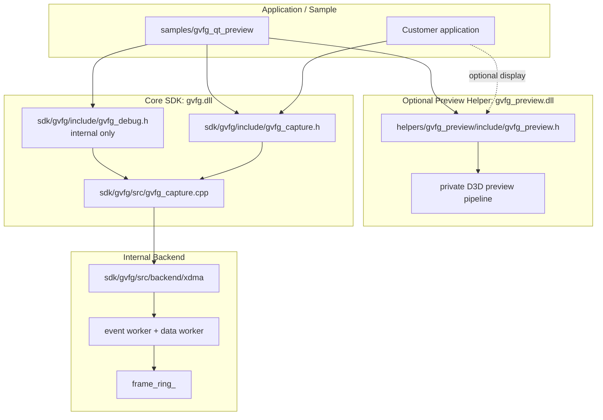

# GVFG Internal Notes

This document is the internal engineering map for the standalone GVFG SDK.
Customer-facing API details live in `docs/GVFG_CUSTOMER_API.md`.

## Current Direction

GVFG is split into three clear pieces:

```text
sdk/gvfg/
  gvfg.dll
  capture API, handle lifecycle, pull frame/event bridge, internal debug API

helpers/gvfg_preview/
  gvfg_preview.dll
  optional display helper; renders gvfg_frame_t after gvfg_read_frame()

samples/gvfg_qt_preview/
  internal debug Qt tool
  uses gvfg.dll + gvfg_preview.dll + gvfg_debug.h
```

The core SDK must stay driver-neutral from the customer's point of view.
XDMA, IRQ, DMA counters, raw FPGA values, and backend details are internal.

## Architecture



## Capture Flow

The capture API follows an FFmpeg-style pull model:

```text
gvfg_enumerate_devices
-> gvfg_create
-> gvfg_open
-> gvfg_start
-> loop:
   gvfg_read_frame
   customer processing and/or gvfg_preview_render_frame
   gvfg_release_frame
   gvfg_poll_event optional
-> gvfg_stop
-> gvfg_destroy
```

`gvfg.dll` does not own the application's public read thread. UI apps should
create their own worker thread and call `gvfg_read_frame()` there.

## Frame Ownership

- `gvfg_read_frame()` returns one SDK-owned frame buffer.
- `frame.data` remains valid until `gvfg_release_frame()` is called.
- A handle may hold only one frame at a time.
- If the application needs data after release, it must copy the frame.
- `gvfg_preview_render_frame()` is synchronous and should be called before
  `gvfg_release_frame()`.

Typical two-way use:

```text
gvfg_read_frame
-> customer-owned display / AI / recording / snapshot
-> optional gvfg_preview_render_frame
-> gvfg_release_frame
```

## Event Boundary

Customer events stay driver-neutral:

```text
GVFG_EVENT_PLUG_IN
GVFG_EVENT_PLUG_OUT
GVFG_EVENT_CAPTURE_PAUSED
GVFG_EVENT_CAPTURE_RESUMED
```

Video IRQ handling is internal to `sdk/gvfg/src/backend/xdma`. IRQ bit numbers,
IRQ masks, DMA counters, and raw FPGA register-like values should not appear in
`gvfg_capture.h`.

## API Surfaces

Customer/demo visible:

```text
include/gvfg_capture.h
include/gvfg_preview.h when display helper is used
```

Internal debug only:

```text
include/gvfg_debug.h
backend counters
interrupt count
DMA errors
raw FPGA signal values
latest backend error detail
PDB symbols
internal diagnostic tools
```

## Package Split

### Demo / Customer Package

Include:

```text
include/gvfg_capture.h
include/gvfg_preview.h when the demo shows video
lib/gvfg.lib
lib/gvfg_preview.lib when the demo shows video
bin/gvfg.dll
bin/gvfg_preview.dll when the demo shows video
samples/customer-facing source
docs/GVFG_CUSTOMER_API.md
```

Do not include:

```text
include/gvfg_debug.h
SDK source
preview helper source
XDMA backend headers
PDB symbols
register / DMA / IRQ debug docs
internal diagnostic tools
```

### Internal Debug Package

Include:

```text
include/gvfg_capture.h
include/gvfg_debug.h
include/gvfg_preview.h
lib/gvfg.lib
lib/gvfg_preview.lib
bin/gvfg.dll
bin/gvfg_preview.dll
bin/gvfg_qt_preview.exe
PDB symbols
internal debug notes
```

### Full Release Package

The full application release can use `gvfg.dll` and `gvfg_preview.dll`, plus
licensing and closed-source application integration. Do not use the full release
package as the daily driver/FPGA bring-up vehicle.

## Build

Top-level CMake builds the core SDK, preview helper, and optional sample:

```text
BUILD_GVFG_SAMPLES=ON
GVFG_XDMA_DEBUG_LOG=OFF
```

Outputs:

```text
bin/gvfg.dll
bin/gvfg_preview.dll
lib/gvfg.lib
lib/gvfg_preview.lib
bin/gvfg_qt_preview.exe
```

`GVFG_XDMA_DEBUG_LOG=ON` enables verbose XDMA flow logging in the internal
backend.

## Draw.io Files

Keep draw.io files for visual discussions:

```text
docs/GVFG_ARCHITECTURE_OVERVIEW.drawio
docs/GVFG_DMA_RING_DATA_FLOW.drawio
```

When code changes only affect API order, package boundaries, or module
ownership, update this Markdown file. Update draw.io only when the deeper data
flow or frame ownership diagram changes.
