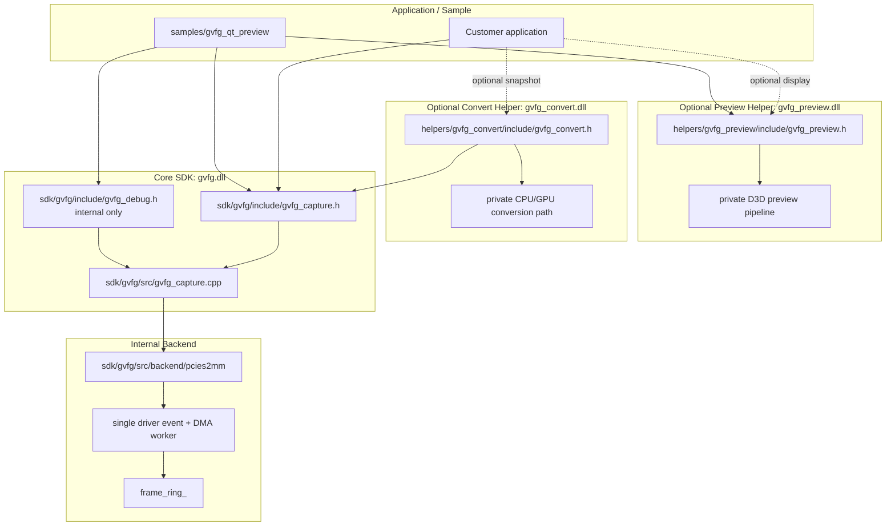

# GVFG Internal Notes

這份文件是 standalone GVFG SDK 的內部工程地圖。客戶端 API 細節請看
`docs/GVFG_CUSTOMER_API.md`。

## 目前方向

GVFG 目前切成幾個清楚的模組：

```text
sdk/gvfg/
  gvfg.dll
  capture API, handle lifecycle, pull frame/event bridge, internal debug API

helpers/gvfg_preview/
  gvfg_preview.dll
  optional display helper; renders gvfg_frame_t after gvfg_read_frame()

helpers/gvfg_convert/
  gvfg_convert.dll
  optional snapshot/export helper; converts native capture frames on request

samples/gvfg_qt_preview/
  gvfg_qt_preview: customer-facing, uses public APIs only
  gvfg_qt_diagnostic: internal build, additionally uses gvfg_debug.h
```

從 customer 角度看，core SDK 必須維持 driver-neutral。PCIES2MM、IRQ、DMA counters、
backend details 都是 internal。

### PCIES2MM backend 檔案分工

`sdk/gvfg/src/backend/pcies2mm/` 內部依責任拆分如下：

```text
pcies2mm_capture_session.{h,cpp}
  stream lifecycle, single driver-event/DMA worker, event dispatch,
  SDK-owned frame ring and frame ownership

pcies2mm_device.{h,cpp}
  Windows SetupAPI device discovery and device interface path

pcies2mm_ioctl.h
  private ABI contract shared with the PCIE S2MM driver:
  IOCTL codes, driver event IDs and DeviceIoControl structures

pcies2mm_reg.h
  FPGA register offsets and bit masks

pcies2mm_video_format.{h,cpp}
  native YUY2/Y210 layout rules and format-register decoding
```

`pcies2mm_ioctl.h` 與 `pcies2mm_reg.h` 都不是 customer public header，不可放進
SDK customer include package。目前板卡只接受 YUY2 與 Y210；這個 FPGA revision 即使
format register 回報 v210，DMA payload 仍由 `pcies2mm_video_format.cpp` 解讀為 Y210。
上述拆分只分離程式責任，不會增加 capture thread。

## 架構



## Capture 流程

Core capture API 的基本模式是 FFmpeg-style pull model：

```text
gvfg_enumerate_devices
-> gvfg_create
-> gvfg_open_channel(CH0 or CH1)
-> gvfg_start
-> loop:
   gvfg_read_frame
   customer processing and/or gvfg_preview_render_frame
   gvfg_release_frame
   gvfg_poll_event optional
-> gvfg_stop
-> gvfg_destroy
```

Pull mode 下，`gvfg.dll` 不擁有 application 的 public read thread。UI app 應該
自己建立 worker thread，並在那個 thread 呼叫 `gvfg_read_frame()`。

`gvfg_start()` 在尚未確認 input signal 時仍會註冊 driver events 並啟動單一 backend
wait thread。`gvfg_read_frame()` 此時 timeout；收到 signal-connected event 後，backend
在相同 thread 重讀 width/height/payload format、resize ring，然後 enable DMA 並送出
capture-resumed event。

FPGA H/V/format registers 可能在拔除來源後保留 last-known values，因此它們只能用來
準備 DMA probe layout，不能當作 signal-present 判斷。啟動時 backend 可以在內部 enable
probe DMA，以涵蓋來源早於 event registration 就已接上的情況；只有收到 driver plug-in
event 或成功取得第一張完整 frame 後，public signal status 才能回報 connected。

## Frame 所有權

- `gvfg_read_frame()` 回傳一個 SDK-owned frame buffer。
- `frame.data` 在 `gvfg_release_frame()` 前有效。
- `gvfg_frame_t` 要保持 ABI-stable；不要為了 layout 直接 append fields。
- `gvfg_handle` 永遠 opaque；stable release 後 `gvfg_frame_t` 凍結，只有 major
  version 可以破壞既有 ABI。
- `gvfg_get_frame_layout()` 回傳 SDK-filled layout metadata：`plane_data`、
  `plane_stride`、`plane_size`。目前 PCIES2MM backend 使用
  width/height/format 推導 tightly packed layout。
- 未來 color/timestamp metadata 應新增各自帶 `struct_size` 的 query output，例如
  `gvfg_get_frame_color_info()` 與 `gvfg_get_frame_timestamp_info()`。不要預先在每個
  struct 放大型 reserved array；等 metadata 類型真的很多再考慮 side data。
- `gvfg_preview.dll` 應優先吃 `gvfg_get_frame_layout()`；layout query 不可用時才
  fallback 到 width-derived stride。
- `gvfg_convert.dll` 負責 explicit snapshot/export conversion。不要把 color
  conversion、image export、GPU conversion policy 搬進 `gvfg.dll`。
- 同一個 handle 一次最多 hold 一個 frame。
- Application 如果 release 後還要用 data，必須自己 copy frame。
- `gvfg_preview_render_frame()` 是 synchronous，應該在 `gvfg_release_frame()` 前呼叫。
- Qt sample 狀態列只顯示 Preview FPS，不顯示 reader/capture FPS。Preview FPS
  由 `gvfg_preview_get_stats()` 提供，只計算 DXGI 接受的 Present；swapchain
  busy skip 不計入，採最近五秒滑動時間窗。

Typical two-way use：

```text
gvfg_read_frame
-> customer-owned display / AI / recording / snapshot
-> optional gvfg_preview_render_frame
-> gvfg_release_frame
```

## Event 邊界

Customer event 保持 driver-neutral：

```text
GVFG_EVENT_SIGNAL_CONNECTED
GVFG_EVENT_SIGNAL_DISCONNECTED
GVFG_EVENT_CAPTURE_PAUSED
GVFG_EVENT_CAPTURE_RESUMED
```

Video IRQ handling 是 `sdk/gvfg/src/backend/pcies2mm` 內部細節。IRQ bit numbers、
IRQ masks 與 DMA counters 不應出現在
`gvfg_capture.h`。

## API Surfaces

Customer/demo 可見：

```text
include/gvfg_capture.h
include/gvfg_preview.h when display helper is used
include/gvfg_convert.h when snapshot/export conversion is used
```

Internal debug only：

```text
include/gvfg_debug.h
backend counters
interrupt count
DMA errors
latest backend error detail
PDB symbols
internal diagnostic tools
```

## Package 切分

### Demo / Customer Package

Include：

```text
include/gvfg_capture.h
include/gvfg_preview.h when the demo shows video
include/gvfg_convert.h when the demo exports snapshots
lib/gvfg.lib
lib/gvfg_preview.lib when the demo shows video
lib/gvfg_convert.lib when the demo exports snapshots
bin/gvfg.dll
bin/gvfg_preview.dll when the demo shows video
bin/gvfg_convert.dll when the demo exports snapshots
samples/customer-facing source
docs/GVFG_CUSTOMER_API.md
```

Do not include：

```text
include/gvfg_debug.h
SDK source
helper source
PCIES2MM backend headers
PDB symbols
register / DMA / IRQ debug docs
internal diagnostic tools
```

### Internal Debug Package

Include：

```text
include/gvfg_capture.h
include/gvfg_debug.h
include/gvfg_preview.h
include/gvfg_convert.h
lib/gvfg.lib
lib/gvfg_preview.lib
lib/gvfg_convert.lib
bin/gvfg.dll
bin/gvfg_preview.dll
bin/gvfg_convert.dll
bin/gvfg_qt_diagnostic.exe
PDB symbols
internal debug notes
```

### Full Release Package

Full application release 可以使用 `gvfg.dll`、`gvfg_preview.dll` 和
`gvfg_convert.dll`，再加上 licensing 與 closed-source application integration。
不要把 full release package 當成 daily driver/FPGA bring-up vehicle。

## Build

Top-level CMake 會 build core SDK、helpers 和 optional sample：

```text
BUILD_GVFG_SAMPLES=ON
GVFG_ENABLE_INTERNAL_DEBUG_API=OFF
BUILD_GVFG_INTERNAL_TOOLS=OFF
GVFG_PCIES2MM_DEBUG_LOG=OFF
```

Customer build 使用 `GVFG_ENABLE_INTERNAL_DEBUG_API=OFF`。此時 `gvfg.dll`
不 export `gvfg_debug_get_backend_stats()` 或
`gvfg_debug_get_last_error_detail()`，install tree 也不包含
`gvfg_debug.h`。

Internal diagnostic build 使用：

```text
BUILD_GVFG_SAMPLES=OFF
GVFG_ENABLE_INTERNAL_DEBUG_API=ON
BUILD_GVFG_INTERNAL_TOOLS=ON
```

只有這個 build 會產生 `gvfg_qt_diagnostic.exe` 並安裝
`gvfg_debug.h`。

輸出產物：

```text
bin/gvfg.dll
bin/gvfg_preview.dll
bin/gvfg_convert.dll
lib/gvfg.lib
lib/gvfg_preview.lib
lib/gvfg_convert.lib
bin/gvfg_qt_preview.exe
```

`GVFG_PCIES2MM_DEBUG_LOG=ON` 會打開 internal backend 的 verbose PCIES2MM flow logging。

## Draw.io Files

保留 draw.io files 方便討論圖：

```text
docs/GVFG_ARCHITECTURE_OVERVIEW.drawio
docs/GVFG_DMA_RING_DATA_FLOW.drawio
```

如果 code change 只影響 API order、package boundary 或 module ownership，更新這份
Markdown 即可。只有 deeper data flow 或 frame ownership diagram 改變時，才需要更新
draw.io。
