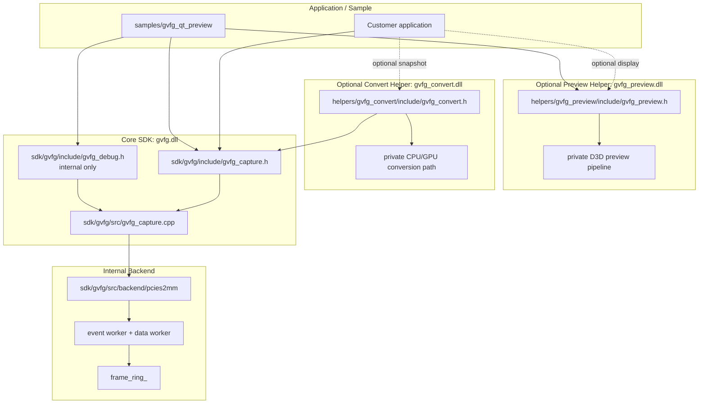

# GVFG Internal Notes

這份文件是 standalone GVFG SDK 的內部工程地圖。客戶端 API 細節請看
`docs/GVFG_CUSTOMER_API.md`。

## 目前方向

GVFG 目前切成幾個清楚的模組：

```text
sdk/gvfg/
  gvfg.dll
  capture API, handle lifecycle, pull frame/event bridge, internal debug API

helpers/gvfg_preview/
  gvfg_preview.dll
  optional display helper; renders gvfg_frame_t after gvfg_read_frame()

helpers/gvfg_convert/
  gvfg_convert.dll
  optional snapshot/export helper; converts native capture frames on request

samples/gvfg_qt_preview/
  internal debug Qt tool
  uses gvfg.dll + gvfg_preview.dll + gvfg_debug.h
```

從 customer 角度看，core SDK 必須維持 driver-neutral。PCIES2MM、IRQ、DMA counters、
raw FPGA values、backend details 都是 internal。

## 架構



## Capture 流程

Core capture API 的基本模式是 FFmpeg-style pull model：

```text
gvfg_enumerate_devices
-> gvfg_create
-> gvfg_open
-> gvfg_start
-> loop:
   gvfg_read_frame
   customer processing and/or gvfg_preview_render_frame
   gvfg_release_frame
   gvfg_poll_event optional
-> gvfg_stop
-> gvfg_destroy
```

Pull mode 下，`gvfg.dll` 不擁有 application 的 public read thread。UI app 應該
自己建立 worker thread，並在那個 thread 呼叫 `gvfg_read_frame()`。

另外提供 optional callback mode，給想讓 SDK 管理 frame/event worker thread 的
application：

```text
gvfg_set_frame_callback
gvfg_set_event_callback optional
gvfg_start_callback_mode
-> SDK-owned frame worker invokes frame callback
-> SDK-owned event worker invokes event callback when configured
-> callback return 後 SDK auto-release frame
gvfg_stop_callback_mode
```

同一個 handle 只能 pull mode 或 callback mode 二選一。Callback mode active 時，
`gvfg_read_frame()` 與 `gvfg_poll_event()` 必須回 `GVFG_ESTATE`。

## Frame 所有權

- `gvfg_read_frame()` 回傳一個 SDK-owned frame buffer。
- `frame.data` 在 `gvfg_release_frame()` 前有效。
- `gvfg_frame_t` 要保持 ABI-stable；不要為了 layout 直接 append fields。
- `gvfg_get_frame_layout()` 回傳 SDK-filled layout metadata：`plane_data`、
  `plane_stride`、`plane_size`、`plane_offset`。目前 PCIES2MM backend 先用
  width/height/format 推導 tightly packed layout；未來 driver 如果能回報真實
  pitch 或 plane offsets，應該更新 layout query path，而不是改既有 frame struct。
- `gvfg_preview.dll` 應優先吃 `gvfg_get_frame_layout()`；layout query 不可用時才
  fallback 到 width-derived stride。
- `gvfg_convert.dll` 負責 explicit snapshot/export conversion。不要把 color
  conversion、image export、GPU conversion policy 搬進 `gvfg.dll`。
- 同一個 handle 一次最多 hold 一個 frame。
- Application 如果 release 後還要用 data，必須自己 copy frame。
- `gvfg_preview_render_frame()` 是 synchronous，應該在 `gvfg_release_frame()` 前呼叫。
- Callback mode 下，frame pointer 只在 frame callback 期間有效；callback return
  後由 SDK 自動 release。
- 同一個 handle 的 frame callback 不併發；event callback 由 SDK-owned event worker
  thread 呼叫，不保證和 frame callback 完全排序。
- 不要在 callback 內呼叫 `gvfg_destroy()`；stop callback mode 應由其他 thread
  呼叫。

Typical two-way use：

```text
gvfg_read_frame
-> customer-owned display / AI / recording / snapshot
-> optional gvfg_preview_render_frame
-> gvfg_release_frame
```

## Event 邊界

Customer event 保持 driver-neutral：

```text
GVFG_EVENT_PLUG_IN
GVFG_EVENT_PLUG_OUT
GVFG_EVENT_CAPTURE_PAUSED
GVFG_EVENT_CAPTURE_RESUMED
```

Video IRQ handling 是 `sdk/gvfg/src/backend/pcies2mm` 內部細節。IRQ bit numbers、
IRQ masks、DMA counters、raw FPGA register-like values 不應出現在
`gvfg_capture.h`。

## API Surfaces

Customer/demo 可見：

```text
include/gvfg_capture.h
include/gvfg_preview.h when display helper is used
include/gvfg_convert.h when snapshot/export conversion is used
```

Internal debug only：

```text
include/gvfg_debug.h
backend counters
interrupt count
DMA errors
raw FPGA signal values
latest backend error detail
PDB symbols
internal diagnostic tools
```

## Package 切分

### Demo / Customer Package

Include：

```text
include/gvfg_capture.h
include/gvfg_preview.h when the demo shows video
include/gvfg_convert.h when the demo exports snapshots
lib/gvfg.lib
lib/gvfg_preview.lib when the demo shows video
lib/gvfg_convert.lib when the demo exports snapshots
bin/gvfg.dll
bin/gvfg_preview.dll when the demo shows video
bin/gvfg_convert.dll when the demo exports snapshots
samples/customer-facing source
docs/GVFG_CUSTOMER_API.md
```

Do not include：

```text
include/gvfg_debug.h
SDK source
helper source
PCIES2MM backend headers
PDB symbols
register / DMA / IRQ debug docs
internal diagnostic tools
```

### Internal Debug Package

Include：

```text
include/gvfg_capture.h
include/gvfg_debug.h
include/gvfg_preview.h
include/gvfg_convert.h
lib/gvfg.lib
lib/gvfg_preview.lib
lib/gvfg_convert.lib
bin/gvfg.dll
bin/gvfg_preview.dll
bin/gvfg_convert.dll
bin/gvfg_qt_preview.exe
PDB symbols
internal debug notes
```

### Full Release Package

Full application release 可以使用 `gvfg.dll`、`gvfg_preview.dll` 和
`gvfg_convert.dll`，再加上 licensing 與 closed-source application integration。
不要把 full release package 當成 daily driver/FPGA bring-up vehicle。

## Build

Top-level CMake 會 build core SDK、helpers 和 optional sample：

```text
BUILD_GVFG_SAMPLES=ON
GVFG_PCIES2MM_DEBUG_LOG=OFF
```

輸出產物：

```text
bin/gvfg.dll
bin/gvfg_preview.dll
bin/gvfg_convert.dll
lib/gvfg.lib
lib/gvfg_preview.lib
lib/gvfg_convert.lib
bin/gvfg_qt_preview.exe
```

`GVFG_PCIES2MM_DEBUG_LOG=ON` 會打開 internal backend 的 verbose PCIES2MM flow logging。

## Draw.io Files

保留 draw.io files 方便討論圖：

```text
docs/GVFG_ARCHITECTURE_OVERVIEW.drawio
docs/GVFG_DMA_RING_DATA_FLOW.drawio
```

如果 code change 只影響 API order、package boundary 或 module ownership，更新這份
Markdown 即可。只有 deeper data flow 或 frame ownership diagram 改變時，才需要更新
draw.io。
