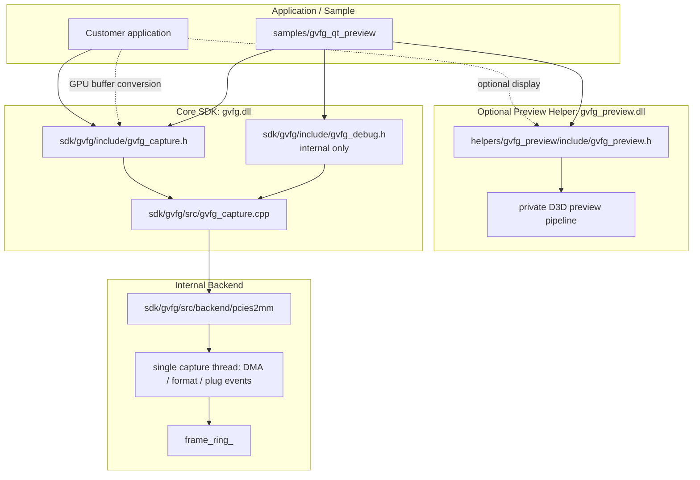

# GVFG Internal Notes

這份文件是 standalone GVFG SDK 的內部工程地圖。客戶端 API 細節請看
`docs/GVFG_CUSTOMER_API.md`。

## 目前方向

GVFG 目前切成幾個清楚的模組：

```text
sdk/gvfg/
  gvfg.dll
  capture API, GPU buffer conversion, handle lifecycle, pull frame/event bridge,
  internal debug API

helpers/gvfg_preview/
  gvfg_preview.dll
  optional display helper; renders gvfg_frame_t after gvfg_read_frame()

samples/gvfg_qt_preview/
  gvfg_qt_preview: diagnostics are selected at configure time
```

從 customer 角度看，core SDK 必須維持 driver-neutral。PCIES2MM、IRQ、DMA counters、
backend details 都是 internal。

### PCIES2MM backend 檔案分工

`sdk/gvfg/src/backend/pcies2mm/` 內部依責任拆分如下：

```text
pcies2mm_capture_session.{h,cpp}
  stream lifecycle, single driver-event/DMA worker, event dispatch,
  SDK-owned frame ring and frame ownership

pcies2mm_device.{h,cpp}
  Windows SetupAPI device discovery and device interface path

pcies2mm_ioctl.h
  private ABI contract shared with the PCIE S2MM driver:
  IOCTL codes, driver event IDs and DeviceIoControl structures

pcies2mm_reg.h
  FPGA register offsets and bit masks

pcies2mm_video_format.{h,cpp}
  native YVYU/Y210 layout rules and format-register decoding
```

`pcies2mm_ioctl.h` 與 `pcies2mm_reg.h` 都不是 customer public header，不可放進
SDK customer include package。目前板卡只輸出 YVYU 與 Y210；這個 FPGA revision 即使
format register 回報 v210，DMA payload 仍由 `pcies2mm_video_format.cpp` 解讀為 Y210。
上述拆分只分離程式責任，不會增加 capture thread。

## 架構



## Capture 流程

Core capture API 的基本模式是 FFmpeg-style pull model：

```text
gvfg_enumerate_devices
-> gvfg_create
-> gvfg_open_channel(CH0 or CH1)
-> gvfg_start
-> loop:
   gvfg_read_frame
   customer processing and/or gvfg_preview_render_frame
   gvfg_release_frame
   gvfg_poll_event optional
-> gvfg_stop
-> gvfg_destroy
```

Pull mode 下，`gvfg.dll` 不擁有 application 的 public read thread。UI app 應該
自己建立 worker thread，並在那個 thread 呼叫 `gvfg_read_frame()`。

`gvfg_start()` 在尚未確認 input signal 時仍會註冊 driver events 並啟動單一 backend
capture thread。`gvfg_read_frame()` 此時 timeout；收到 signal-connected event 後，
backend 在相同 thread 重讀 width/height/payload format、resize ring，然後 enable DMA。
第一張完整 frame publish 後，public event queue 收到 `GVFG_EVENT_STREAM_READY`。

FPGA H/V/format registers 可能在拔除來源後保留 last-known values，因此它們只能用來
準備 DMA probe layout，不能當作 signal-present 判斷。啟動時 backend 可以在內部 enable
probe DMA，以涵蓋來源早於 event registration 就已接上的情況；只有收到 driver plug-in
event 或成功取得第一張完整 frame 後，public signal status 才能回報 connected。DMA
probe 成功不偽造 plug-in event，而是送出 `GVFG_EVENT_STREAM_READY`。

## Internal DMA / Ring Data Flow

Driver DMA buffer 與 SDK `frame_ring_` 是兩層不同的 storage。Driver buffer 負責接收
硬體 DMA；SDK ring 保存一份 user-mode copy，讓 application 能持有 frame 到
`gvfg_release_frame()`。三個 SDK ring slots 只增加緩衝空間，每一張 frame 仍只有一次
driver-to-SDK copy。

目前完整路徑：

```text
video source produces one frame
-> hardware writes driver DMA buffer N
-> DMA complete interrupt
-> driver SetEvent(dma_event_)
-> capture_thread_proc() wakes from WaitForMultipleObjects()
-> handle_dma_event()
-> IOCTL_GET_VIDEO_DONE_INDEX
-> frameIndex = doneIndex % kDmaBufferCount (currently 16)
-> search the 3-slot SDK frame_ring_ for slot.in_use == false
-> mark slot: ready=false, in_use=true
-> IOCTL_GET_FRAME
-> one copy: driver DMA buffer N -> slot.data
-> validate bytesReturned == expected frame size
-> publish_frame()
   - sequence = ++latest_sequence_
   - ready = true
   - in_use = false
   - frame_cv_.notify_one()
-> gvfg_read_frame() / wait_frame() wakes
-> select the newest ready sequence
-> mark delivered slot: ready=false, in_use=true
-> return gvfg_frame_t pointing at slot.data
-> preview / conversion / customer processing
-> gvfg_release_frame()
-> mark slot.in_use=false
-> data_cv_.notify_all()
-> slot becomes reusable
```

FrameSlot 的主要狀態：

```text
Free       : ready=false, in_use=false
Writing    : ready=false, in_use=true
Ready      : ready=true,  in_use=false
Delivered  : ready=false, in_use=true
Released   : ready=false, in_use=false
```

同步責任：

- `mutex_` 保護 `frame_ring_`、slot flags、sequence 與 active delivery slot。
- `frame_cv_` 喚醒等待 ready frame 的 `wait_frame()`。
- `data_cv_` 喚醒等待 free slot 的 capture thread。
- `eventMutex`、`eventCv` 與 `eventQueue` 是 public capture event 的另一套同步機制，
  不保存 frame。

如果三個 SDK slots 全部 `in_use`，capture thread 目前會在 `data_cv_` 等待，不會主動
從 SDK ring 丟掉 application 正在持有的 frame。硬體與 driver DMA 仍可能繼續前進，
因此等待期間的中間 frame 可能在 driver 層被覆寫或 event 被合併，形成隱性掉幀。
這是 backpressure policy，不是 lossless queue 保證。

## Frame 所有權

- `gvfg_read_frame()` 回傳一個 SDK-owned frame buffer。
- `frame.data` 在 `gvfg_release_frame()` 前有效。
- `frame.row_stride_bytes` 是相鄰兩列起點之間的 byte 距離；consumer 不應自行
  由 width/format 猜 stride。
- 現行 YVYU/Y210 都是 single-plane packed buffers，因此不公開 plane-layout API。
- 未來真的加入 multi-plane format 時，再新增獨立的 plane-layout query。
- `gvfg_handle` 永遠 opaque；stable release 後 `gvfg_frame_t` 凍結，只有 major
  version 可以破壞既有 ABI。
- 未來 color/timestamp metadata 應新增獨立的 query output，例如
  `gvfg_get_frame_color_info()` 與 `gvfg_get_frame_timestamp_info()`。不要預先在每個
  struct 放大型 reserved array；等 metadata 類型真的很多再考慮 side data。
- `gvfg_preview.dll` 直接使用 capture frame 的 `row_stride_bytes`。
- `gvfg.dll` 提供 explicit GPU buffer conversion；API 不負責 image export、
  thread、queue 或 frame ownership policy。
- 同一個 handle 一次最多 hold 一個 frame。
- Application 如果 release 後還要用 data，必須自己 copy frame。
- `gvfg_preview_render_frame()` 是 synchronous，應該在 `gvfg_release_frame()` 前呼叫。
- Qt sample 狀態列只顯示 Preview FPS，不顯示 reader/capture FPS。Preview FPS
  由 `gvfg_preview_get_stats()` 提供，只計算 DXGI 接受的 Present；swapchain
  busy skip 不計入，採最近五秒滑動時間窗。

Typical two-way use：

```text
gvfg_read_frame
-> customer-owned display / AI / recording / snapshot
-> optional gvfg_preview_render_frame
-> gvfg_release_frame
```

## Event 邊界

Customer event 保持 driver-neutral：

```text
GVFG_EVENT_SIGNAL_CONNECTED
GVFG_EVENT_SIGNAL_DISCONNECTED
GVFG_EVENT_STREAM_READY
GVFG_EVENT_FORMAT_CHANGE_BEGIN
```

事件語意：

- `GVFG_EVENT_SIGNAL_CONNECTED`：backend 收到真正的 driver plug-in event。
- `GVFG_EVENT_SIGNAL_DISCONNECTED`：backend 收到真正的 driver plug-out event。
- `GVFG_EVENT_FORMAT_CHANGE_BEGIN`：收到 driver format-change event，舊格式資源即將
  失效；backend 自動停止舊 DMA、重讀格式並恢復 capture。
- `GVFG_EVENT_STREAM_READY`：start、plug-in recovery 或 format recovery 後，第一張
  完整 frame 已經 publish。Application 可讀取新 `gvfg_frame_t`，依其中的
  width/height/pixel_format/bit_depth 重建 render resources。

Format change 是兩階段通知：

```text
driver format-change event
-> GVFG_EVENT_FORMAT_CHANGE_BEGIN
-> backend disables old DMA/video
-> backend refreshes width/height/payload format and resizes ring
-> backend enables capture
-> first complete new-format frame is published
-> GVFG_EVENT_STREAM_READY
```

Application 可在 `FORMAT_CHANGE_BEGIN` 暫停 render 或清理舊格式資源，但不應自行對同一
session 執行 Stop/Start；backend 負責恢復。在 `STREAM_READY` 後，以新 frame metadata
重建並恢復 render。

Video IRQ handling 是 `sdk/gvfg/src/backend/pcies2mm` 內部細節。IRQ bit numbers、
IRQ masks 與 DMA counters 不應出現在
`gvfg_capture.h`。

## API Surfaces

Customer/demo 可見：

```text
include/gvfg_capture.h
include/gvfg_preview.h when display helper is used
```

Internal debug only：

```text
include/gvfg_debug.h
backend counters
interrupt count
DMA errors
latest backend error detail
PDB symbols
internal diagnostic tools
```

## Package 切分

### Demo / Customer Package

Include：

```text
include/gvfg_capture.h
include/gvfg_preview.h when the demo shows video
lib/gvfg.lib
lib/gvfg_preview.lib when the demo shows video
bin/gvfg.dll
bin/gvfg_preview.dll when the demo shows video
samples/customer-facing source
docs/GVFG_CUSTOMER_API.md
```

Do not include：

```text
include/gvfg_debug.h
SDK source
helper source
PCIES2MM backend headers
PDB symbols
register / DMA / IRQ debug docs
internal diagnostic tools
```

### Internal Debug Package

Include：

```text
include/gvfg_capture.h
include/gvfg_debug.h
include/gvfg_preview.h
lib/gvfg.lib
lib/gvfg_preview.lib
bin/gvfg.dll
bin/gvfg_preview.dll
bin/gvfg_qt_preview.exe
PDB symbols
internal debug notes
```

### Full Release Package

Full application release 可以使用 `gvfg.dll` 與 `gvfg_preview.dll`，再加上
licensing 與 closed-source application integration。
不要把 full release package 當成 daily driver/FPGA bring-up vehicle。

## Build

Top-level CMake 會 build core SDK、helpers 和 optional sample：

```text
BUILD_GVFG_SAMPLES=ON
```

Internal diagnostic build 使用 Debug configuration：

```text
cmake --build build --target gvfg_qt_preview --config Debug
```

這個 build 仍產生 `gvfg_qt_preview.exe`，但會把 internal diagnostics
編譯進同一個執行檔。

輸出產物：

```text
bin/gvfg.dll
bin/gvfg_preview.dll
lib/gvfg.lib
lib/gvfg_preview.lib
bin/gvfg_qt_preview.exe
```

Debug configuration 也會打開 internal backend 的 verbose PCIES2MM flow logging。

## Draw.io Files

保留 draw.io files 方便討論圖：

```text
docs/GVFG_ARCHITECTURE_OVERVIEW.drawio
docs/GVFG_DMA_RING_DATA_FLOW.drawio
```

如果 code change 只影響 API order、package boundary 或 module ownership，更新這份
Markdown 即可。只有 deeper data flow 或 frame ownership diagram 改變時，才需要更新
draw.io。
