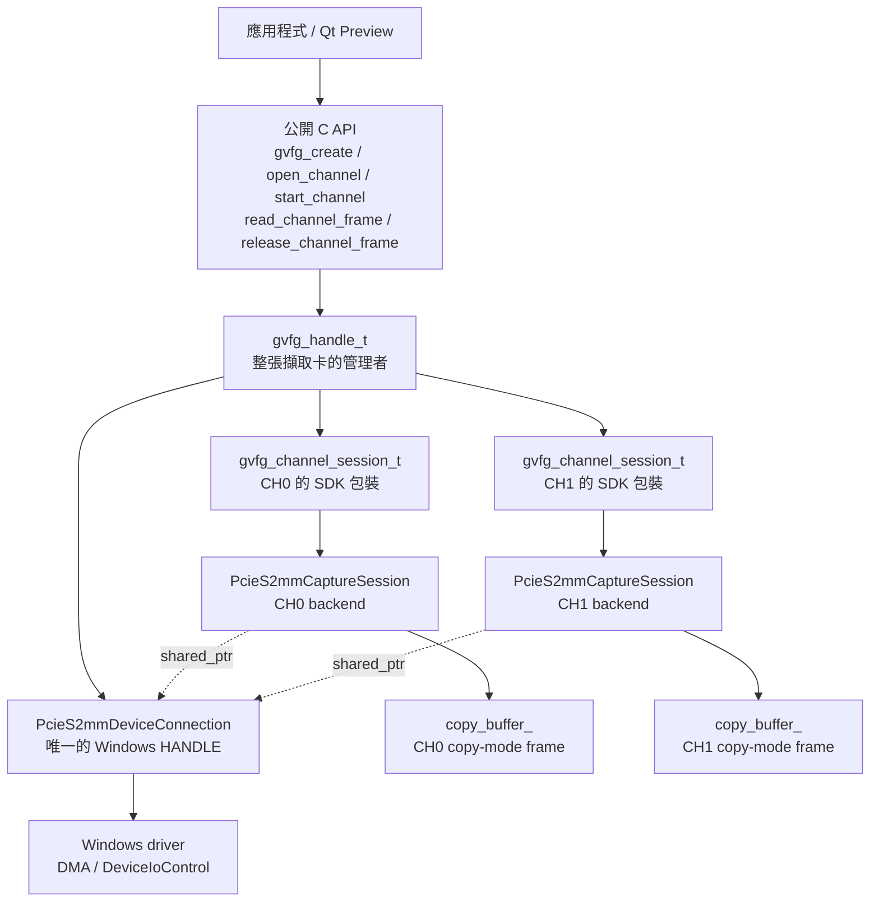

# GVFG SDK 專案與 C++ 物件架構

> 學習文件入口：[`GVFG_LEARNING_INDEX.md`](GVFG_LEARNING_INDEX.md)
> 延伸閱讀：[`GVFG_ERROR_HANDLING.md`](GVFG_ERROR_HANDLING.md)、[`GVFG_FRAME_FLOW_AND_STATE.md`](GVFG_FRAME_FLOW_AND_STATE.md)

可以把整個架構理解成：**應用程式拿一個總管理 handle，裡面可以管理兩條 channel；兩條 channel 共用同一個 driver connection，但各自有自己的擷取狀態與 frame buffer。**

## 目前模組分工

```text
samples/gvfg_qt_preview
    客戶範例應用程式；呼叫公開 C API，不應依賴 SDK private header

sdk/gvfg/include
    對外公開的 capture API、資料結構與 status

sdk/gvfg/src/gvfg_capture.cpp
    C ABI facade、opaque handle、channel 管理、參數驗證、frame token、event queue

sdk/gvfg/src/backend/pcies2mm
    driver device、register、DMA/event、copy/zero-copy 與 backend 狀態

sdk/giga_ioctl
    獨立 driver ABI DLL；只包裝 IOCTL，不持有 capture lifecycle

helpers/gvfg_preview
    獨立 preview helper DLL；只負責顯示，不擁有 capture frame
```

這些 DLL 邊界是刻意保留的維護責任，不應為了減少檔案而全部合併。



## 第一層：公開的 `gvfg_handle`

公開 header 裡大致是：

```cpp
struct gvfg_handle_t;
typedef struct gvfg_handle_t *gvfg_handle;
```

使用者看到的是：

```cpp
gvfg_handle handle = nullptr;
gvfg_create(&handle);
```

`gvfg_handle` 實際上就是指向 `gvfg_handle_t` 的 pointer：

```cpp
gvfg_handle
// 等同概念：
gvfg_handle_t*
```

之所以不讓使用者直接看到 `gvfg_handle_t` 內容，是為了隱藏 SDK 內部實作。

應用程式只需要知道：

```cpp
gvfg_open_channel(handle, ...);
gvfg_start_channel(handle, ...);
gvfg_read_channel_frame(handle, ...);
```

不用知道裡面的 C++ class。

---

## 第二層：`gvfg_handle_t`

目前的核心結構是：

```cpp
struct gvfg_handle_t
{
    std::array<ChannelErrorState, 2> channelErrors;

    std::shared_ptr<
        gvfg::internal::PcieS2mmDeviceConnection
    > deviceConnection;

    std::array<
        std::unique_ptr<gvfg_channel_session_t>,
        2
    > channels;

    std::array<uint32_t, 2> eventMasks{
        GVFG_EVENT_MASK_ALL,
        GVFG_EVENT_MASK_ALL
    };

    int currentIndex = -1;
    std::array<bool, 2> zeroCopyRequested{false, false};
};
```

它代表「一張擷取裝置的 SDK 操作環境」。

### `deviceConnection`

```cpp
std::shared_ptr<PcieS2mmDeviceConnection> deviceConnection;
```

負責保存底層 Windows driver connection。

剛執行 `gvfg_create()` 時：

```cpp
deviceConnection == nullptr;
```

第一次執行 `gvfg_open_channel()` 後才會建立。

### `channels`

```cpp
std::array<std::unique_ptr<gvfg_channel_session_t>, 2> channels;
```

是固定兩格的陣列：

```cpp
channels[0]  // CH0
channels[1]  // CH1
```

剛執行 `gvfg_create()` 時：

```cpp
channels[0] == nullptr;
channels[1] == nullptr;
```

如果只開 CH0：

```text
channels[0] → CH0 session
channels[1] → nullptr
```

如果兩條都開：

```text
channels[0] → CH0 session
channels[1] → CH1 session
```

### 為什麼用 `unique_ptr`？

```cpp
std::unique_ptr<gvfg_channel_session_t>
```

表示每一條 channel session 只有一個擁有者：

```text
channels[0] 獨自擁有 CH0 session
channels[1] 獨自擁有 CH1 session
```

`gvfg_handle_t` 被刪除時，兩個 session 會自動被刪除，不需要手動 `delete`。

---

## 第三層：`gvfg_channel_session_t`

每條 channel 都各有一個：

```cpp
struct gvfg_channel_session_t
{
    ChannelErrorState &errorState;
    std::unique_ptr<PcieS2mmCaptureSession> backend;

    int currentIndex;
    uint32_t selectedChannel;
    bool zeroCopyRequested;
    uint32_t eventMask;

    std::atomic<bool> running;
    bool readInProgress;
    bool frameHeld;

    pcies2mm_frame_t heldBackendFrame;

    // FPS、signal、event queue 等其他狀態
};
```

它是「公開 GVFG API」與「底層 PCIES2MM backend」中間的包裝層。

例如應用程式呼叫：

```cpp
gvfg_read_channel_frame(handle, GVFG_CHANNEL_0, ...);
```

流程大致為：

```text
gvfg_read_channel_frame()
        ↓
找到 channels[0]
        ↓
gvfg_channel_session_t::readFrame()
        ↓
PcieS2mmCaptureSession::wait_frame()
        ↓
driver IOCTL
```

它主要負責：

- 將公開的 `gvfg_status_t` 與 backend status 互相轉換。
- 與 backend 共用該 channel 的 `ChannelErrorState`。
- 保存公開 API 層的 frame ownership 狀態。
- 防止同一 channel 同時進行兩次 read。
- 確認成功讀到的 frame 有且只 release 一次。
- 保存 signal、FPS、event queue 等 SDK 狀態。

---

## 第四層：`PcieS2mmCaptureSession`

這是實際操作 PCIES2MM driver 的單一 channel backend：

```cpp
class PcieS2mmCaptureSession
{
    std::shared_ptr<PcieS2mmDeviceConnection>
        device_connection_;

    HANDLE dma_event_;
    HANDLE format_change_event_;
    HANDLE plug_in_event_;
    HANDLE plug_out_event_;

    uint32_t channel_;
    bool configured_;
    bool zero_copy_enabled_;

    std::vector<uint8_t> copy_buffer_;
    pcies2mm_frame_t held_frame_;

    bool frame_held_;
    bool read_in_progress_;

    std::thread capture_thread_;

    // mutex、condition_variable、signal cache、stats...
};
```

CH0、CH1 各有自己的 `PcieS2mmCaptureSession`，因此它們各自擁有：

- 自己的 DMA event
- 自己的 signal event
- 自己的 capture thread
- 自己的 mutex
- 自己的 frame 狀態
- 自己的 copy buffer
- 自己的 channel index

但是兩者的：

```cpp
device_connection_
```

指向同一個 connection。

---

## 第五層：`PcieS2mmDeviceConnection`

目前非常單純：

```cpp
struct PcieS2mmDeviceConnection
{
    HANDLE handle = INVALID_HANDLE_VALUE;

    ~PcieS2mmDeviceConnection();
};
```

它只負責 Windows device handle 的生命週期。

第一次開啟裝置時：

```cpp
connection->handle = CreateFileW(...);
```

最後一個 `shared_ptr` 被釋放時，destructor 執行：

```cpp
PcieS2mmDeviceConnection::~PcieS2mmDeviceConnection()
{
    if (handle != INVALID_HANDLE_VALUE)
        CloseHandle(handle);
}
```

### 為什麼這裡使用 `shared_ptr`？

因為同一個 connection 同時被三個地方引用：

```text
gvfg_handle_t
CH0 PcieS2mmCaptureSession
CH1 PcieS2mmCaptureSession
```

它們共同使用同一個 Windows `HANDLE`。

只要仍有其中一個 `shared_ptr` 存在，connection 就不會被刪除。

---

## Frame 資料放在哪裡？

### Copy mode

每條 channel 的 backend 都有：

```cpp
std::vector<uint8_t> copy_buffer_;
```

開始擷取、知道解析度後才配置：

```cpp
copy_buffer_.assign(bytes, 0);
```

例如：

```text
CH0 backend
└─ copy_buffer_ → CH0 最新 frame 資料

CH1 backend
└─ copy_buffer_ → CH1 最新 frame 資料
```

公開給應用程式的：

```cpp
gvfg_frame_t::data
```

會指向：

```cpp
copy_buffer_.data()
```

### Zero-copy mode

`copy_buffer_` 不配置影像空間。

Driver 回傳 DMA memory pointer：

```cpp
held_frame_.data = driverMemory;
```

SDK 只暫時保存 pointer，實際資料仍屬於 driver。

---

## `struct` 與 `class` 有什麼差別？

在 C++ 裡兩者幾乎一樣，主要差別只是預設存取權限。

### `struct`

預設為 `public`：

```cpp
struct Example
{
    int value;
};
```

外面可以直接使用：

```cpp
Example e;
e.value = 10;
```

### `class`

預設為 `private`：

```cpp
class Example
{
    int value;  // 外面不能直接存取
};
```

通常這個專案的使用方式是：

- `struct`：資料集合或簡單管理物件。
- `class`：包含較多狀態控制與操作邏輯。

但這只是程式設計習慣，不是語言上的硬性限制。

---

## 整個建立過程

```text
gvfg_create()
│
├─ 建立 gvfg_handle_t
├─ deviceConnection = nullptr
├─ channels[0] = nullptr
└─ channels[1] = nullptr

gvfg_open_channel(CH0)
│
├─ 建立 CH0 gvfg_channel_session_t
├─ 建立 CH0 PcieS2mmCaptureSession
├─ CreateFileW() 開啟 driver
└─ deviceConnection 保存 Windows HANDLE

gvfg_open_channel(CH1)
│
├─ 建立 CH1 gvfg_channel_session_t
├─ 建立 CH1 PcieS2mmCaptureSession
└─ 共用既有 deviceConnection

gvfg_start_channel(CH0)
│
├─ 取得 CH0 signal/format
├─ 配置 CH0 copy_buffer_（copy mode）
├─ 建立／註冊 CH0 events
└─ 啟動 CH0 capture

gvfg_start_channel(CH1)
│
├─ 取得 CH1 signal/format
├─ 配置 CH1 copy_buffer_（copy mode）
├─ 建立／註冊 CH1 events
└─ 啟動 CH1 capture
```

最簡單的記法是：

```text
gvfg_handle_t
    = 整張卡

gvfg_channel_session_t
    = 公開 API 所看到的一條 channel

PcieS2mmCaptureSession
    = 實際操作 driver 的一條 channel

PcieS2mmDeviceConnection
    = CH0、CH1 共用的 Windows driver 連線

copy_buffer_
    = 單一 channel 的 copy-mode 影像記憶體
```
