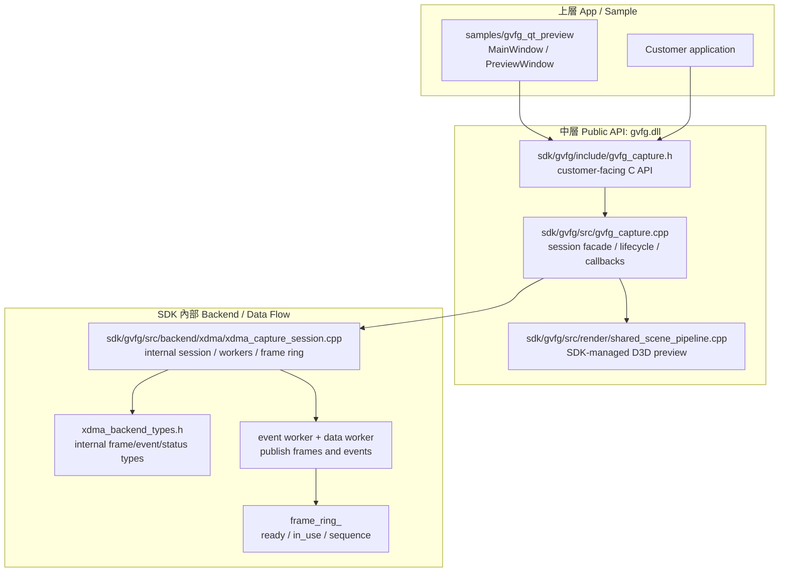
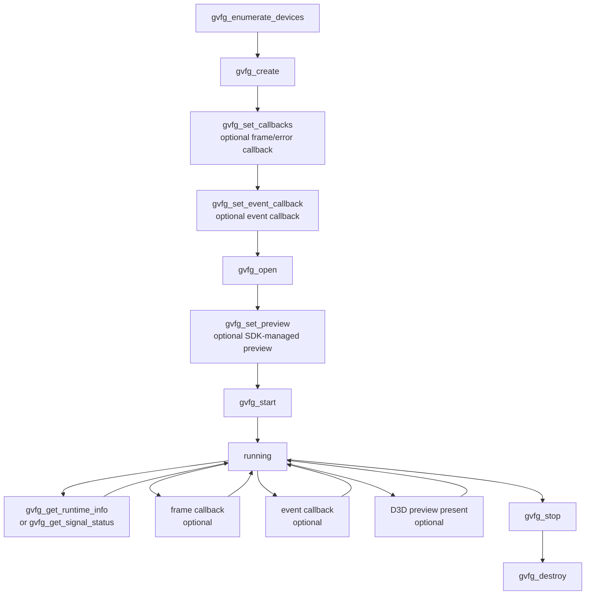
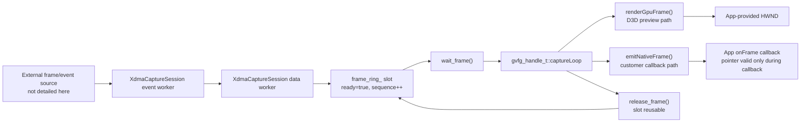
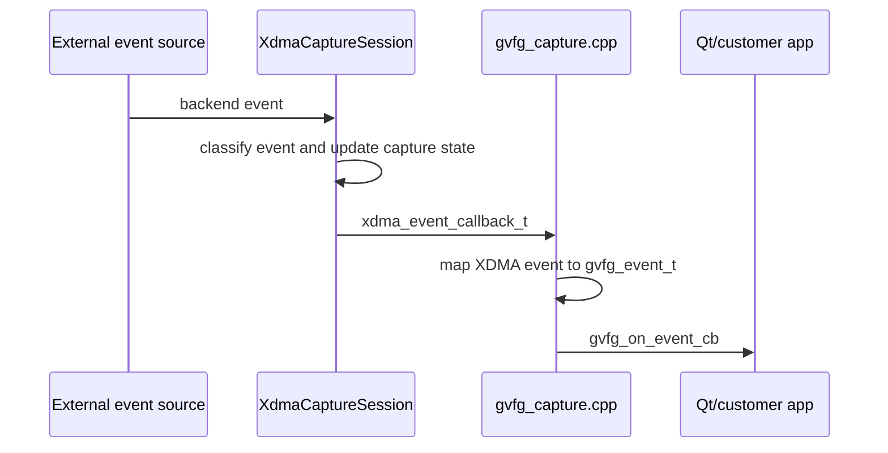
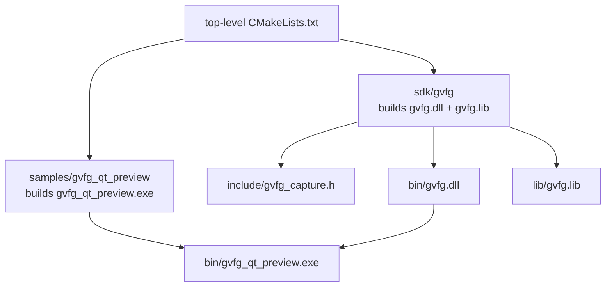

# GVFG Project Map

這份文件的目標是幫人快速釐清 GVFG Standalone SDK 的專案分層。依目前工作範圍，圖的邊界停在 SDK 內部 backend；更底層的外部輸入來源先不展開。

建議不要只畫一張巨大流程圖，因為這個專案同時有「使用者 API」、「SDK 內部 worker」、「preview render」和「frame/event 轉交」幾條不同的線。最清楚的方式是分成 3 到 4 張不同視角的圖。

## 建議圖層

| 圖 | 回答的問題 | 適合格式 |
| --- | --- | --- |
| 1. 架構分層圖 | 哪些 code 屬於 App / API / SDK backend? | Mermaid 或 draw.io |
| 2. API 生命週期圖 | App 呼叫 API 的正確順序是什麼? | Mermaid flowchart |
| 3. SDK Frame 資料流圖 | frame 在 SDK 內部怎麼進 ring、出 callback / preview? | Mermaid 或 draw.io |
| 4. Event / hotplug 圖 | backend event 怎麼回到 App? | Mermaid sequence |

draw.io 適合畫第 3 張的進階版，尤其是 worker thread、ring slot ownership、callback lifetime 這類需要精準框線的圖。其他圖建議放在 Markdown 裡用 Mermaid，這樣改 code 時可以一起 diff 和 review。

## 1. 架構分層圖



### 三大塊對照

| 你說的層 | 專案裡的實際位置 | 主要責任 |
| --- | --- | --- |
| 1. 上層 App | `samples/gvfg_qt_preview` | UI、device selection、start/stop、status 顯示、preview window HWND |
| 2. 中層 API | `sdk/gvfg/include`, `sdk/gvfg/src/gvfg_capture.cpp` | 對外 C API、handle 狀態、callback/event 轉接、runtime info、preview pipeline 管理 |
| 3. 底層資料流 | `sdk/gvfg/src/backend/xdma` | SDK 內部 worker、frame ring、event/frame 轉交、backend 狀態 |

`sdk/gvfg/src/render` 是中層 API 內部的 preview 支線，不是客戶 App 的 UI。它吃 backend frame，輸出 D3D swapchain 到 App 傳入的 `HWND`。

## 2. API 生命週期圖



上層 App 目前的主要路徑在 `samples/gvfg_qt_preview/mainwindow.cpp`:

1. `refreshDevices()` calls `gvfg_enumerate_devices()`.
2. `openDevice()` calls `gvfg_create()`, callback setup, then `gvfg_open()`.
3. `startCapture()` calls `gvfg_set_preview()` and `gvfg_start()`.
4. A timer calls `gvfg_get_runtime_info()` to refresh signal, preview, callback, and FPS status.
5. `stopCapture()` calls `gvfg_stop()`, and `closeDevice()` calls `gvfg_destroy()`.

## 3. SDK Frame 資料流圖



這張圖如果要再細畫，重點應該放在 SDK 內部 ownership:

1. data worker 什麼時候寫入 `frame_ring_`。
2. `wait_frame()` 什麼時候把 slot 交給 `gvfg_capture.cpp`。
3. `renderGpuFrame()` 和 `emitNativeFrame()` 共用同一個 backend frame 的時間點。
4. `release_frame()` 後 slot 什麼時候可重用。

更底層的外部來源細節先不放進這張圖。

## 4. Event / Hotplug 圖



`VIDEO_IRQ` 類型的事件會推動 frame 資料進入 SDK frame path。Hotplug 類型事件則可能讓 backend pause/resume capture，並透過 `gvfg_on_event_cb` 通知 App。

## 5. Build / 交付圖



客戶整合時應該只依賴:

```text
include/gvfg_capture.h
lib/gvfg.lib
bin/gvfg.dll
```

`sdk/gvfg/src/backend/xdma` 內的 header 和 types 都是 SDK 內部實作細節，不應該被客戶 App include。

## 建議維護方式

1. `GVFG_PROJECT_MAP.md`: 放高階架構、生命週期、SDK 內部資料流，適合每天看。
2. `GVFG_ARCHITECTURE_OVERVIEW.drawio`: 放同一個三層視角的可視化版本，適合討論。
3. `GVFG_DMA_RING_DATA_FLOW.drawio`: 若暫時只看 SDK code，可先當作底層參考，不放在主要 onboarding 流程。
4. `GVFG_CUSTOMER_API.md`: 放 API 文件和客戶整合說明，適合交付和支援。

當 code 改動只影響 API 呼叫順序或 module 邊界，更新 Markdown 圖。當 code 改動影響 SDK worker、frame ring、callback lifetime，才更新 draw.io 細節圖。
